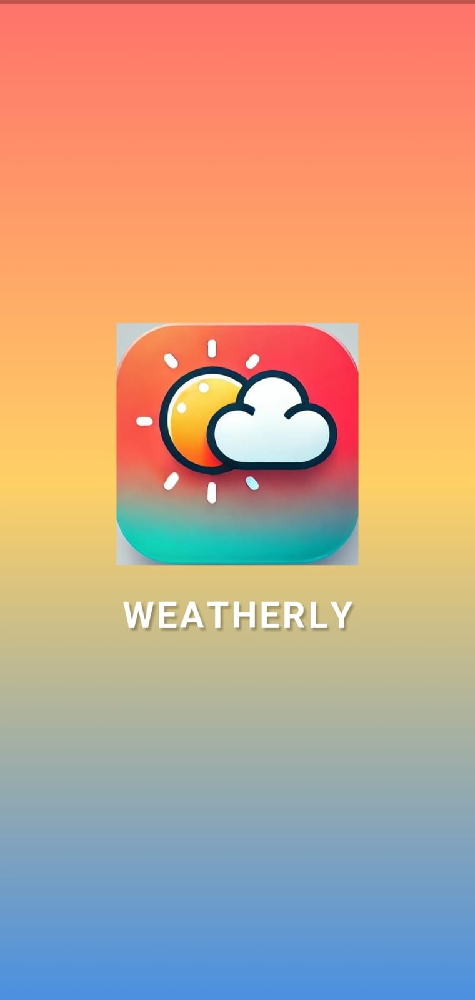
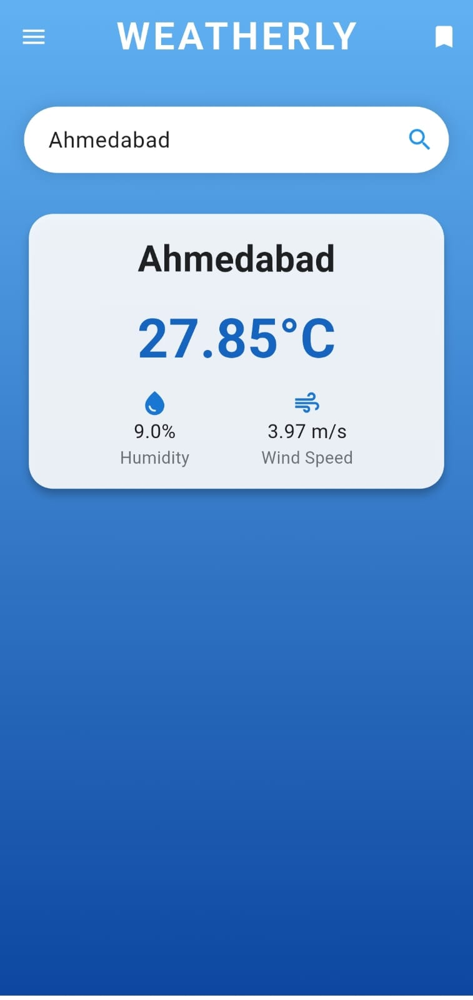
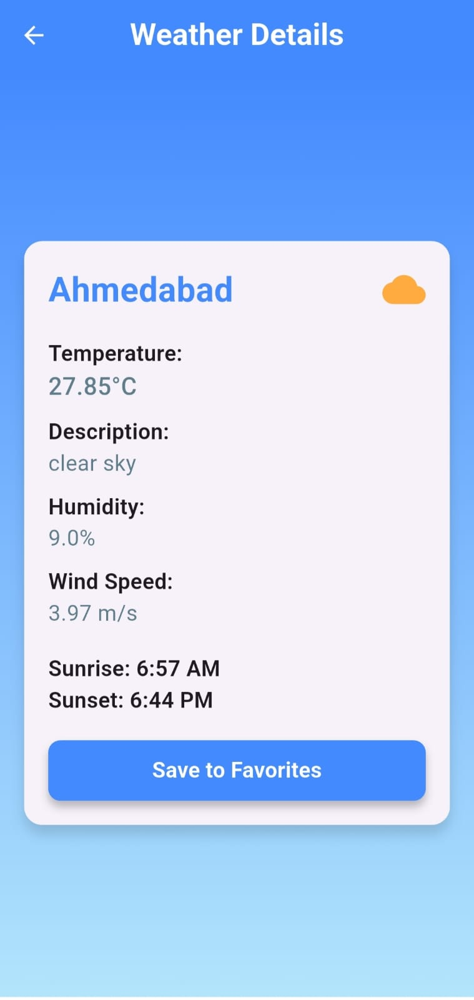
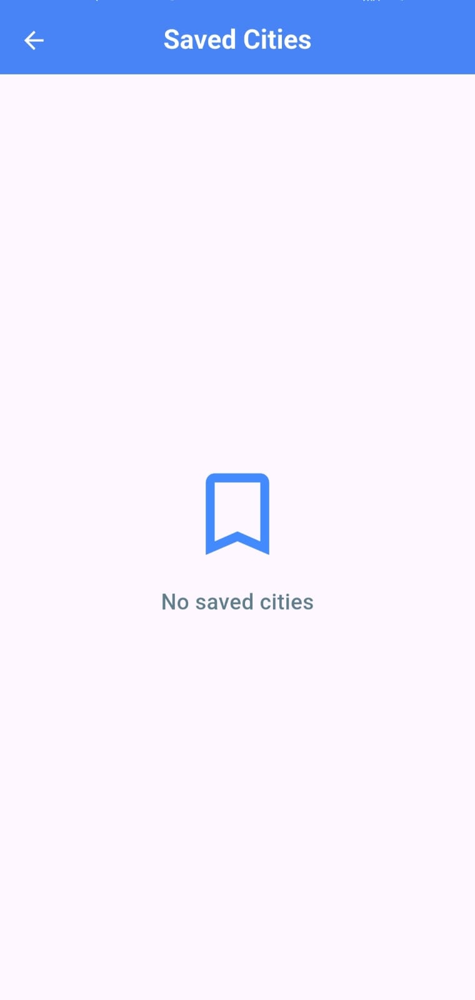
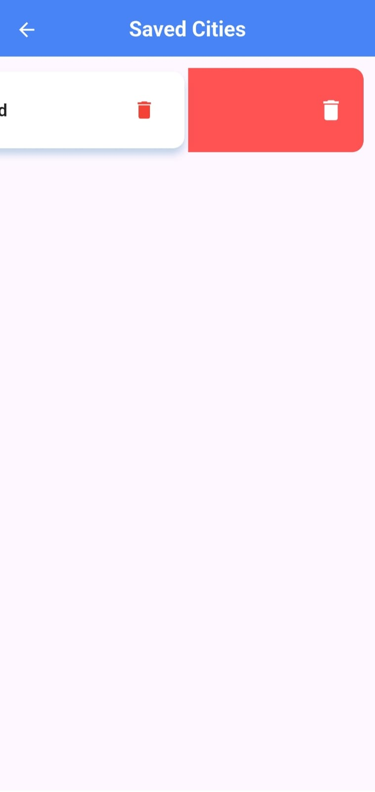

# 🌤 Weatherly

**WEATHERLY** is a feature-rich weather application built using Flutter, designed to provide users with accurate and timely weather information. This app integrates essential features such as API calling, Shared Preferences, and network connectivity checks to enhance the user experience.

---

## 🚀 Features

- **🌎 City/State/Country-Wise Weather Details**  
  Get real-time weather updates for any city, state, or country.
  
- **🌐 API Integration**  
  Fetches live weather data from reliable sources.
  
- **💾 Shared Preferences**  
  Save favorite locations and access them quickly.
  
- **📶 Network Connectivity Check**  
  Ensures seamless access to weather data with error handling.
  
- **🌙 Light & Dark Themes**  
  Customize the app’s appearance for comfortable viewing.
  
- **⏳ Splash Screen**  
  Engaging startup screen for a smooth user experience.
  
- **📊 Detailed Weather Screens**  
  Comprehensive data, including temperature, humidity, wind speed, and forecasts.

---

## 📸 Screenshots















---

## 🛠 Tech Stack

- **Flutter** - Cross-platform app development
- **Dart** - Programming language
- **Shared Preferences** - Local storage
- **REST APIs** - Fetching weather data

---

## 🔧 Installation

1. **Clone the repository**
   ```bash
   git clone https://github.com/your-username/sky-scrapper.git
   cd sky-scrapper
   ```
2. **Install dependencies**
   ```bash
   flutter pub get
   ```
3. **Run the app**
   ```bash
   flutter run
   ```

---

## 🎨 UI Previews

| Light Mode | Dark Mode |
|------------|----------|
|  |  |

---

## 📌 Future Enhancements

- 🌩️ Severe weather alerts
- 📍 Location-based automatic weather updates
- 📅 Weather history and trends

---

## 🤝 Contributing

Contributions are welcome! Feel free to open issues or submit pull requests.

---

## 📜 License

This project is licensed under the **MIT License**.

---

## 🌟 Show Your Support

If you like this project, please ⭐️ the repository!

---

_“Quality is our Motto.” Shaping **skills** for **scaling** higher...!!!_ ✨
